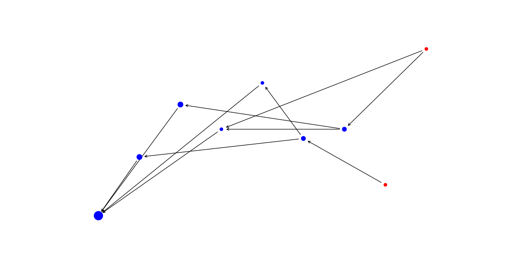
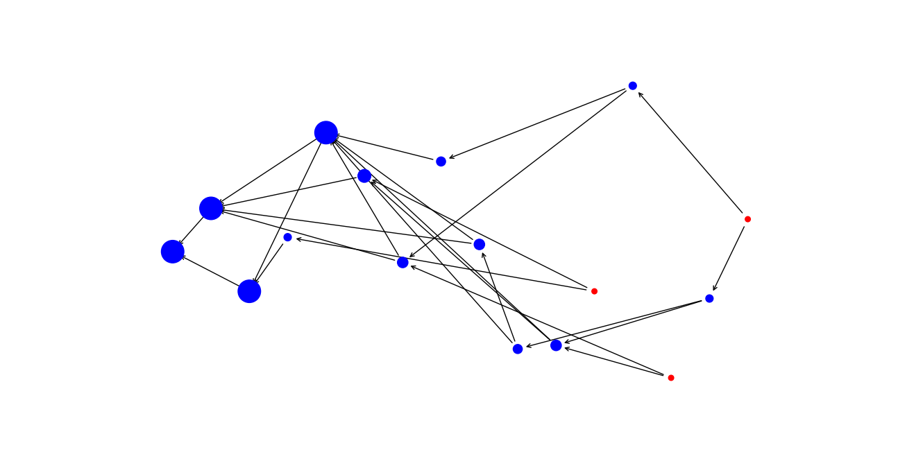
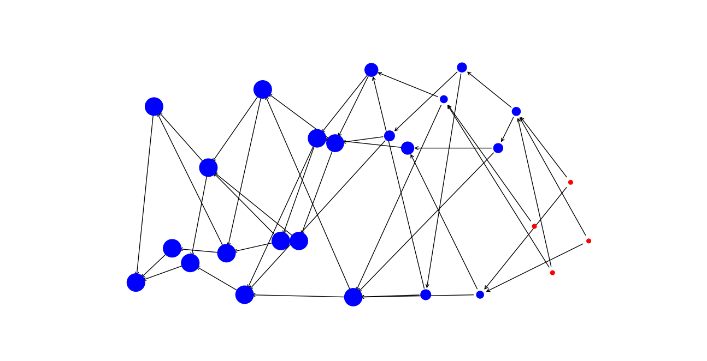

# tangle
IOTA Tangle (directed acyclic graph) implemented with python

----

Python implementation of IOTA's [whitepaper](https://assets.ctfassets.net/r1dr6vzfxhev/2t4uxvsIqk0EUau6g2sw0g/45eae33637ca92f85dd9f4a3a218e1ec/iota1_4_3.pdf).

This implementation is purly of the Tangle data structure, the 'Site' class can be extended to support transactions and the 'Approval' class can be extended to support PoW approvals and different levels of difficulty.

For good development experience I included a draw method to the 'Tangle' class to allow you to see your graph visually.  

  
  
  
